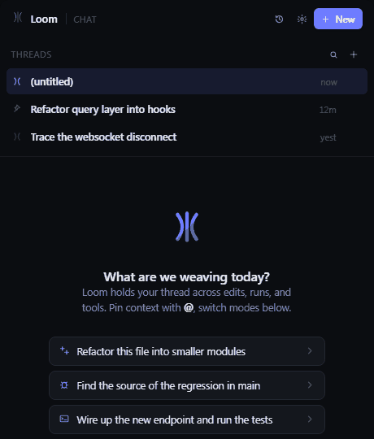

# Loom

Loom is a VS Code AI coding agent with a TypeScript extension host, a React
webview, and a Go backend. The Go agent owns the LLM loop and pure-Go tools;
the TypeScript host owns VS Code APIs, approvals, sessions, and webview state.



## Install

For local testing, install one of the per-platform VSIX files from `dist/`:

```bash
code --install-extension dist/loom-win32-x64.vsix
```

Use the VSIX that matches your platform:

- `loom-darwin-arm64.vsix`
- `loom-darwin-x64.vsix`
- `loom-linux-arm64.vsix`
- `loom-linux-x64.vsix`
- `loom-win32-x64.vsix`

The binaries are not code-signed for v1.0. macOS Gatekeeper and Windows
SmartScreen may require the workaround documented in `TROUBLESHOOTING.md`.

## First Run

Open the Loom view from the activity bar. The first-run panel lets you choose:

- Anthropic with an Anthropic API key
- OpenAI with an OpenAI API key
- Local OpenAI-compatible endpoint, such as Ollama

API keys are stored in VS Code SecretStorage. Loom also supports `.env` and
environment variables for development.

## Build

Requires Node 20+ and Go 1.22+.

```bash
npm run install:all
npm run build
```

This produces:

- `dist/extension.js` - bundled extension host
- `dist/webview/` - built React webview
- `bin/agent-<platform>-<arch>` - Go agent for the current platform

## Package

```bash
npm run package
```

Packaging cross-compiles the Go agent for all supported targets, builds the
webview and extension bundle, then writes one VSIX per platform to `dist/`.
Each VSIX is staged with only the matching Go binary.

Before packaging a release, bump the root package version and lockfile version
so generated VSIX metadata matches the Marketplace release.

## Configuration

Important settings:

- `loom.provider`: `anthropic`, `openai`, or `local`
- `loom.telemetry.enabled`: opt-in telemetry, disabled by default
- `loom.telemetry.endpoint`: HTTPS endpoint for batched sanitized events
- `loom.mcp.servers`: stdio MCP server configuration
- `loom.ui.accent`, `loom.ui.density`, `loom.ui.themeBias`: webview theme

Telemetry never sends prompts, file contents, workspace paths, API keys, or raw
machine IDs.

## Architecture

```text
React webview <-> TypeScript extension host <-> Go agent binary
        postMessage        JSON-RPC 2.0 over LSP framing
```

Wire types live in `src/shared/protocol.ts`.

## Contributing

See `CONTRIBUTING.md` for development workflow, release notes, and PR
expectations. See `TROUBLESHOOTING.md` for common setup, packaging, and
runtime issues.
